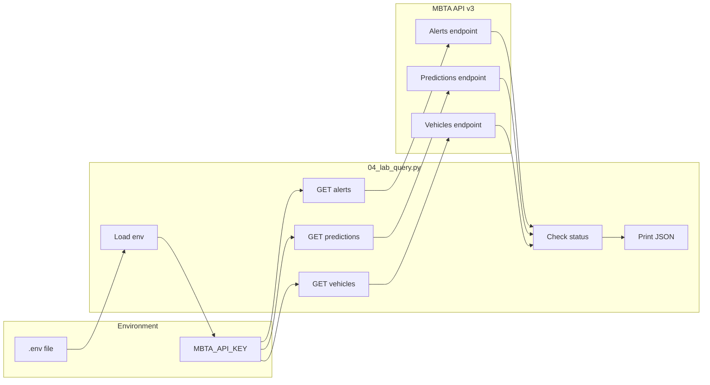

# Lab 1 README

> Documentation for the Lab 1 API query script: [`04_lab_query.py`](04_lab_query.py). This script queries the **MBTA API v3** for Red Line service alerts, predictions at Alewife, and vehicle positions.

---

## Context for Cursor

**Primary file:** `01_query_api/04_lab_query.py`  
**Intent:** Three sequential GET calls (alerts → predictions → vehicles) to MBTA API v3; each response is validated then printed as JSON.  
**Response variables in script:** `alerts_response`, `predictions_response`, `vehicles_response` (each has `.status_code`, `.text`, `.json()`).  
**Env:** `MBTA_API_KEY` in `.env` (optional); header `x-api-key` when set.  
**Constants in script:** `BASE_URL = "https://api-v3.mbta.com"`, Alewife stop ID `place-alfcl`, route filter `Red`.  
**Conventions:** Use `requests.get(..., headers=HEADERS, params={...})`, then `if response.status_code != 200: print(...); exit(1)`. API calls live under the section `# 1. API Calls` in the script.  
**Join key:** Predictions and vehicles can be linked by `vehicle` `id` or by trip/stop IDs in the response `data` and `included`.

---

## Table of Contents

- [Context for Cursor](#context-for-cursor)
- [Overview](#overview)
- [API Endpoints and Parameters](#api-endpoints-and-parameters)
- [Data Structures](#data-structures)
- [Data Flow Diagram](#data-flow-diagram)
- [Usage Instructions](#usage-instructions)
- [Extension guidelines (for future development)](#extension-guidelines-for-future-development)

---

## Overview

[`04_lab_query.py`](04_lab_query.py) performs three HTTP GET requests to the [MBTA API v3](https://api-v3.mbta.com/docs/swagger/index.html) and prints the raw JSON responses. It is designed for [LAB: Develop a Meaningful API Query](LAB_your_good_api_query.md) and returns multiple records suitable for building a reporter application.

**Functionality:**

1. **Alerts** — Fetches active and inactive **Red Line** service alerts (severity, description, start/end times).
2. **Predictions** — Fetches **departures and arrivals** at **Alewife** (`place-alfcl`) for the Red Line, with related schedule, trip, stop, and vehicle data.
3. **Vehicles** — Fetches **Red Line vehicles** and their current stop and trip so you can match vehicles to predictions (e.g., “train currently at X, arriving at Alewife in Y minutes”).

The script loads an API key from a `.env` file (optional; the API works without a key but may have lower rate limits), checks response status codes, and exits on failure. It uses `requests` for HTTP and `python-dotenv` for environment variables.

---

## API Endpoints and Parameters

Base URL: **`https://api-v3.mbta.com`**

| Call        | Endpoint        | Method | Parameters | Purpose |
|------------|------------------|--------|------------|---------|
| **Alerts** | `/alerts`        | GET    | `filter[route]=Red` | Red Line service alerts only |
| **Predictions** | `/predictions` | GET | `filter[stop]=place-alfcl`, `filter[route]=Red`, `include=schedule,trip,stop,vehicle` | Departures/arrivals at Alewife with related resources |
| **Vehicles** | `/vehicles`   | GET    | `filter[route]=Red`, `include=trip,stop` | Red Line vehicles with current trip and stop |

**Parameter details:**

- **`filter[route]`** — Restricts results to the given route type or ID (e.g. `Red`).
- **`filter[stop]`** — For predictions, limits to the given stop ID (`place-alfcl` = Alewife).
- **`include`** — Comma-separated list of related resources to embed in the response (e.g. `schedule,trip,stop,vehicle` for predictions; `trip,stop` for vehicles).

**Headers:** If `MBTA_API_KEY` is set in `.env`, the script sends it as `x-api-key`; otherwise no API key header is sent.

---

## Data Structures

Responses follow the [JSON:API](https://jsonapi.org/) style: top-level **`data`** (array of resources) and **`included`** (optional array of related resources).

### Alerts (`/alerts`)

- **`data`** — Array of alert resources.
  - **`id`** — Alert ID.
  - **`type`** — `"alert"`.
  - **`attributes`** — e.g. `severity`, `description`, `lifecycle`, `active_period` (start/end times), `informed_entity`, etc.
- **`included`** — Optional related entities (e.g. stops, routes) when requested via `include`.

### Predictions (`/predictions`)

- **`data`** — Array of prediction resources.
  - **`id`**, **`type`** (`"prediction"`).
  - **`attributes`** — e.g. `departure_time`, `arrival_time`, `direction_id`, `status`, `schedule_relationship`.
  - **`relationships`** — References to `schedule`, `trip`, `stop`, `vehicle` (IDs and optional `data`).
- **`included`** — Embedded **schedule**, **trip**, **stop**, and **vehicle** objects when `include=schedule,trip,stop,vehicle` is used. Each has `id`, `type`, and `attributes` (e.g. trip `headsign`, stop `name`, vehicle `current_status`).

### Vehicles (`/vehicles`)

- **`data`** — Array of vehicle resources.
  - **`id`**, **`type`** (`"vehicle"`).
  - **`attributes`** — e.g. `current_status`, `current_stop_sequence`, `bearing`.
  - **`relationships`** — References to `trip` and `stop` (current stop).
- **`included`** — **trip** and **stop** objects when `include=trip,stop` is used.

You can join predictions to vehicles by matching **vehicle `id`** (or trip/stop IDs) between the predictions and vehicles responses.

---

## Data Flow Diagram



**Sequence (high level):** Load `.env` → send three GET requests (alerts, predictions, vehicles) with optional API key → validate status → print each response JSON.

---

## Usage Instructions

1. **Prerequisites**
   - Python 3 with `requests` and `python-dotenv` installed (e.g. `pip install requests python-dotenv`).
   - Optional: Create a `.env` in the project root (or the directory you run from) with `MBTA_API_KEY=your_key` for higher rate limits; the script runs without it.

2. **Run the script**
   - From the repo root:  
     `python 01_query_api/04_lab_query.py`  
   - Or from `01_query_api`:  
     `python 04_lab_query.py`

3. **Expected output**
   - Console lines: “Alerts request successful”, “Predictions request successful”, “Vehicles request successful”, each followed by the raw JSON for that endpoint. If any request fails, the script prints the status code and response text and exits with code 1.

4. **Using the data**
   - Alerts: Use for service disruption messaging.
   - Predictions: Use for “next departures/arrivals at Alewife” and estimated times.
   - Vehicles: Use to show “train currently at [stop]” and link to predictions via vehicle/trip/stop IDs.

5. **Note**
   - The script ends with `globals().clear()`, which clears the global namespace (useful in some interactive or teaching contexts). Omit or comment out that line if you want to keep variables in memory after the script runs.

---

## Extension guidelines (for future development)

Use this section when extending or refactoring the script so behavior stays consistent.

**Key files**

| Purpose | Path |
|--------|------|
| Main script | `01_query_api/04_lab_query.py` |
| Lab instructions | `01_query_api/LAB_your_good_api_query.md` |

**Code locations in `04_lab_query.py`**

- Setup and constants: `# 0. Setup` and `## 0.2 Load Environment` (BASE_URL, HEADERS).
- All API calls: `# 1. API Calls` (alerts, predictions, vehicles in that order).
- Cleanup: `# Clear Environment` at end of file.

**Reference snippet (reuse for new endpoints)**

```python
response = requests.get(
    f"{BASE_URL}/your_endpoint",
    headers=HEADERS,
    params={"filter[route]": "Red", "include": "trip,stop"},  # adjust as needed
)
if response.status_code != 200:
    print("Request failed:", response.status_code, response.text)
    exit(1)
# then use response.json()
```

**Conventions to keep**

- Use the same `HEADERS` and `BASE_URL`; add new params in the `params` dict.
- Keep the status-code check and `exit(1)` on failure so the script fails fast.
- Use exact string literals: stop ID `place-alfcl`, route `Red`, header key `x-api-key`.
- Response shape is JSON:API: top-level `data` (list) and optional `included`; join resources by `id` and `type`.

**Avoid**

- Removing or softening the HTTP status check (script should exit on non-200).
- Hardcoding a different base URL or header name; change only via the existing constants.
- Adding new endpoints without the same `include`/filter pattern documented in [API Endpoints and Parameters](#api-endpoints-and-parameters).

---

← 🏠 [Back to Top](#table-of-contents)
