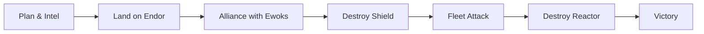
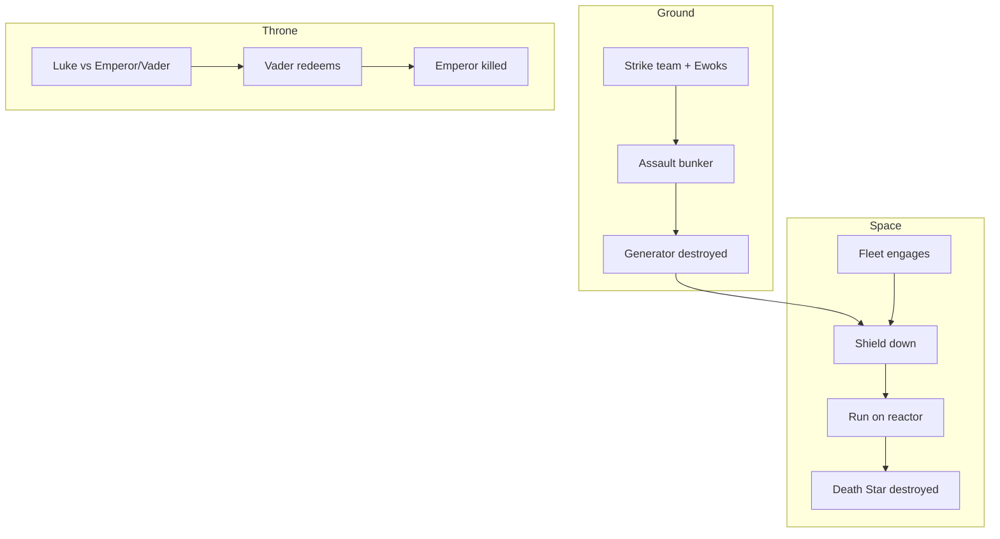

# Return of the Jedi — The Rebel Alliance

> The Rebel Alliance’s campaign to destroy the second Death Star and overthrow the Empire, as depicted in *Star Wars: Episode VI — Return of the Jedi*. This README summarizes the operation for quick reference.

## Table of Contents

- [Overview](#overview)
- [Requirements](#requirements)
- [Preparation](#preparation)
- [Execution](#execution)
- [Key forces](#key-forces)
- [Key locations](#key-locations)
- [Contributing](#contributing)
- [Outcome](#outcome)
- [Reference links](#reference-links)

---

## Overview

The **Rebel Alliance** executes a multi-pronged operation to eliminate the **Galactic Empire**’s new Death Star and Emperor Palpatine. Success depends on a ground team disabling the station’s shield generator on the forest moon of **Endor**, while the Rebel fleet engages the Imperial Navy and the station itself. The story is the climax of the original trilogy. For full plot and production details, see the [official synopsis](https://www.starwars.com/films/star-wars-episode-vi-return-of-the-jedi) and [Wikipedia](https://en.wikipedia.org/wiki/Return_of_the_Jedi).

---

## Requirements

- **Shield generator down** — The Death Star is protected by a planetary shield; it must be destroyed from the surface of Endor.
- **Fleet readiness** — Capital ships and starfighters assembled and briefed on the attack profile.
- **Ground team** — Infiltration unit capable of reaching the generator bunker and neutralizing Imperial defenses.
- **Local support** — Alliance with the **Ewoks** of Endor to overcome Imperial garrison and armor.

---

## Preparation

1. **Intelligence** — Confirm Death Star location (Endor sector) and shield generator site on the moon.
2. **Strike team** — Luke Skywalker, Leia Organa, Han Solo, Chewbacca, C-3PO, R2-D2, and others deploy to Endor via captured Imperial shuttle.
3. **Fleet** — Admiral Ackbar leads the Rebel fleet to the rendezvous point; General Calrissian coordinates fighter groups.
4. **Diplomacy** — Secure Ewok cooperation (with C-3PO’s “translation” and R2-D2’s help) for the assault on the bunker.

---

## Execution

**Ground (Endor):**

1. Strike team lands and is initially captured by Ewoks.
2. After a truce, Rebels and Ewoks assault the shield generator bunker.
3. Imperial counterattack (AT-STs, troopers) is repelled with Ewok tactics and captured walkers.
4. Han’s team breaches the bunker and destroys the generator; the shield drops.

**Space (Death Star approach):**

1. Rebel fleet jumps in and engages Imperial starfighters and capital ships.
2. Emperor uses the incomplete Death Star’s superlaser to target Rebel capital ships.
3. After the shield falls, Rebel fighters enter the station’s superstructure and attack the reactor core.
4. Lando (in the *Millennium Falcon*) and Wedge Antilles lead the run; the reactor is destroyed and the Death Star explodes.

**Throne room (parallel):**

- Luke confronts Vader and the Emperor; refuses to turn to the dark side.
- Vader redeems himself by saving Luke and killing Palpatine; Vader dies and the Empire’s leadership is decapitated.

---

## Key forces

| Faction        | Role |
|----------------|------|
| **Rebel Alliance** | Fleet engagement, starfighter strike on reactor, command (Ackbar, Calrissian). |
| **Endor strike team** | Disable shield generator; key figures: Han, Leia, Luke (later diverted), Chewie, droids. |
| **Ewoks**      | Local ground forces; traps, guerrilla tactics, and captured AT-ST. |
| **Imperial Navy** | Defense of Death Star and Endor; TIE fighters, Star Destroyers. |
| **Emperor & Vader** | Aboard the Death Star; final confrontation with Luke. |

---

## Key locations

- **Endor (forest moon)** — Shield generator bunker; Ewok villages; site of the ground battle.
- **Death Star II** — Incomplete battle station; throne room (Emperor, Vader, Luke); reactor core (target of Rebel fighters).
- **Space above Endor** — Fleet battle between Rebel and Imperial capital ships and fighters.

---

## Diagrams

**Campaign flow: from plan to victory**

**Parallel threads on the climax day**

---

## Contributing

- **Rebel High Command** — Strategy and fleet deployment.
- **Rogue Group / Red Squadron** — Fighter strike into the Death Star (Wedge, Lando, others).
- **Endor strike team** — Shield generator mission.
- **Ewoks** — Ground combat and local knowledge.
- **Luke Skywalker** — Confrontation with Emperor and Vader; Vader’s turn to the light.

---

## Outcome

- **Second Death Star** destroyed; Imperial fleet routed.
- **Emperor** killed; **Darth Vader** redeemed and deceased.
- **Rebel Alliance** achieves a decisive victory; path to restoring the Republic opens.
- Celebrations on Endor (and later, galaxy-wide) mark the fall of the Empire.

---

## Reference links

| Resource | URL |
|----------|-----|
| Star Wars — Return of the Jedi (official) | https://www.starwars.com/films/star-wars-episode-vi-return-of-the-jedi |
| Return of the Jedi (Wikipedia) | https://en.wikipedia.org/wiki/Return_of_the_Jedi |
| Battle of Endor (Wookieepedia) | https://starwars.fandom.com/wiki/Battle_of_Endor |
| Mermaid (diagrams) | https://mermaid.js.org/intro/ |

---

← [Back to top](#return-of-the-jedi--the-rebel-alliance)
